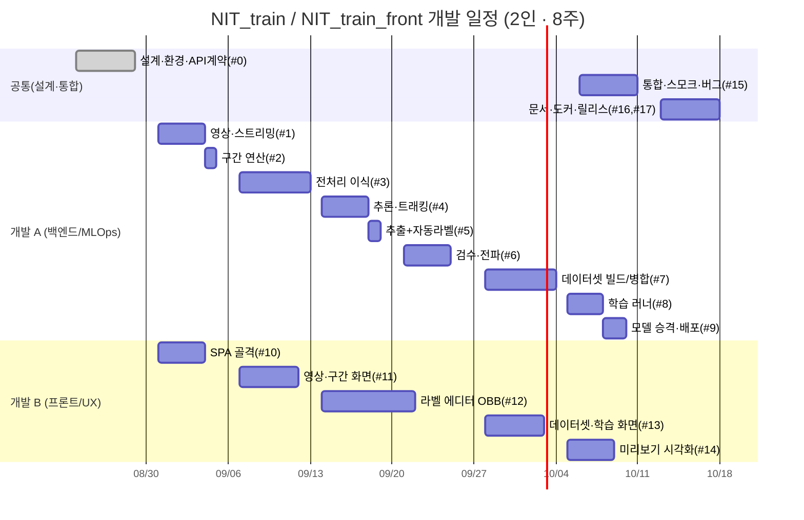

# 개발 일정 (Development Schedule)

> 대상: `NIT_train`(학습·라벨링 API) + `NIT_train_front`(웹 UI)
> 기준: **2인 개발**, 약 **8주(2개월)**, 온프레미스/폐쇄망 전제
> 작성일: 2026-08-18

이 문서는 "지금 우리가 만들고 있는 것"을 **처음부터 다시 만든다고 가정**했을 때의
표준 개발 일정이다. 실제로는 이미 상당 부분이 구현되어 있으므로(§7 현재 진척도),
남은 작업 산정과 새 인력 온보딩·외부 보고용 기준선으로 쓴다.

---

## 1. 전제와 산정 기준

- **인원**: 2명 (나 / 민규님). 둘 다 Python·FastAPI·JS 가능, YOLO 사용 경험 있음.
- **가동**: 주 5일, 1일 실효 6h(회의·리뷰·잡무 제외). 1주 = 2인 × 5일 = **10 person-day(PD)**.
- **환경**: `NIT` conda 환경, GPU 1대(학습 검증용), 폐쇄망(외부 패키지 설치 제약).
- **규모 근거**: 백엔드 ≈ 4,900줄(Python), 프론트 ≈ 4,000줄(JS/CSS/HTML), 문서 6종.
- **난이도 가중**: 전처리 이식(Zero-DCE++/DCP), OBB 좌표계, 트래킹 전파, 학습 서브프로세스
  관리는 "조용히 틀리기 쉬운" 영역이라 테스트·버퍼를 더 얹었다.

---

## 2. 역할 분담

| 구분 | 담당 | 주 책임 영역 |
|---|---|---|
| **개발 A** | 나 | 백엔드·MLOps 파이프라인(코어/전처리/추론/자동라벨/데이터셋/학습/배포), API 계약 |
| **개발 B** | 민규님 | 프론트엔드 SPA·라벨링 UX(구간 타임라인, OBB 라벨 에디터, 미리보기 시각화, 데이터셋/학습 화면) |
| **공통** | 나 + 민규님 | 초기 설계, API 스키마 합의, 통합 테스트, 스모크/문서, 도커화 |

> 경계 작업(미리보기, 구간 UI ↔ 추출 잡)은 **API 계약을 먼저 확정**하고 양쪽이 병렬로 진행한다.

---

## 3. 작업 분해(WBS)와 공수

| # | 작업 패키지 | 담당 | 공수(PD) |
|---|---|---|---:|
| 0 | 설계·환경 셋업 (레이아웃, config/store, 잡 레지스트리, API 계약 초안) | 공통 | 5 |
| 1 | 영상 등록·메타·스트리밍(Range)·썸네일 | A | 4 |
| 2 | 구간(정상/비정상) 저장·구간 연산(합집합/차집합) | A | 3 |
| 3 | 전처리 파이프라인 이식 (Zero-DCE++·DCP dehaze·CLAHE·주야 자동판정) | A | 6 |
| 4 | 추론·트래킹 (detector, OBB/detect 분기, poly/track_id) | A | 4 |
| 5 | 프레임 추출 + 자동 라벨 초안 잡 (샘플링·전처리·트래킹) | A | 4 |
| 6 | 라벨 CRUD·검수·클래스 전파·오버레이 | A | 4 |
| 7 | 데이터셋 빌드/임포트/병합·data.yaml·분할(chunk) | A | 6 |
| 8 | 학습 러너(자식 프로세스)·상태(state)·중단/재개 | A | 5 |
| 9 | 모델 레지스트리·승격·tracker_py 배포 연동 | A | 3 |
| 10 | 프론트 SPA 골격(라우팅/공통 UI/API 클라이언트) | B | 4 |
| 11 | 영상·구간 화면(타임라인, 마우스 마킹, 재생 컨트롤) | B | 5 |
| 12 | 라벨링 에디터(Canvas OBB 회전박스, 선택/전파, 단축키) | B | 8 |
| 13 | 데이터셋·학습·모델 화면 | B | 5 |
| 14 | 추출 전 미리보기(전처리+모델 탐지, 연속 트래킹) | A+B | 4 |
| 15 | 통합·스모크 테스트(`smoke_api`/`smoke_obb`)·버그픽스 | 공통 | 5 |
| 16 | 문서 6종(architecture/api/dataset/labeling/env/standards) | 공통 | 3 |
| 17 | 도커화·배포 리허설·최종 버퍼 | 공통 | 4 |
| | **합계** | | **82 PD** |

> 8주 × 10PD = 80PD 용량 대비 82PD → 초과분은 리스크 버퍼(§6)에서 흡수하거나
> 라벨 에디터 고급 기능(#12) 일부를 2차로 미룬다.

---

## 4. 주차별 계획 (8주)

| 주차 | 개발 A (백엔드/MLOps) | 개발 B (프론트/UX) | 주말 마일스톤 |
|---|---|---|---|
| **W1** | #0 설계·config/store·잡 레지스트리 | #0 API 계약 합의·SPA 골격(#10 착수) | **M1** 골격 기동, 계약 확정 |
| **W2** | #1 영상 등록/스트리밍 · #2 구간 | #10 완료 · #11 영상·구간 화면 | **M2** 영상 올리고 구간 지정 가능 |
| **W3** | #3 전처리 이식(Zero-DCE++/DCP/CLAHE) | #11 타임라인·마우스 마킹 마감 | **M3** 전처리 결과 미리보기 확인 |
| **W4** | #4 추론·트래킹 · #5 추출+자동라벨 잡 | #12 라벨 에디터(회전박스 그리기) | **M4** 영상→자동 라벨 초안 생성 |
| **W5** | #6 라벨 검수·클래스 전파 API | #12 선택/전파/단축키 마감 | **M5** 사람 검수·전파 왕복 완성 |
| **W6** | #7 데이터셋 빌드/임포트/병합 | #13 데이터셋·학습 화면 | **M6** 승인 라벨→데이터셋 스냅샷 |
| **W7** | #8 학습 러너 · #9 모델 승격/배포 | #14 미리보기(탐지/트래킹) 프론트 | **M7** 1 epoch 학습→best.pt 승격 |
| **W8** | #14 미리보기 백엔드 · #15 통합·버그 | #15 통합·UX 다듬기 · #16 문서 | **M8** 스모크 통과·도커·릴리스 |

---

## 5. 마일스톤 요약

| 마일스톤 | 시점 | "됐다"의 정의(수용 기준) |
|---|---|---|
| M1 | W1말 | 프론트↔API 통신, `/api/meta` 응답, 잡 레지스트리 동작 |
| M2 | W2말 | 영상 업로드·스트리밍·정상/비정상 구간 저장/조회 |
| M3 | W3말 | 주/야간 자동판정 + 저조도·안개·CLAHE 결과가 원본 대비 검증됨 |
| M4 | W4말 | 구간→프레임 추출→트래킹 자동 라벨 초안 JSON 생성 |
| M5 | W5말 | 라벨 검수·`track_id` 클래스 전파·프레임 승인 왕복 |
| M6 | W6말 | 승인 라벨로 YOLO 데이터셋 + `data.yaml`, 기존 폴더 임포트/병합 |
| M7 | W7말 | 자식 프로세스 학습 1 epoch 완주 → `best.pt` 승격 |
| M8 | W8말 | `smoke_api`/`smoke_obb` 통과, 도커 볼륨 마운트로 상태 보존, 문서 완비 |

---

## 6. 리스크와 버퍼

| 리스크 | 영향 | 대응 |
|---|---|---|
| 전처리 이식 결과가 추론과 미세하게 다름(밝기·색) | 라벨-추론 불일치 | tracker_py 가중치(`Epoch99.pth`) 번들·CPU 폴백, 헤더로 적용값 노출·비교 |
| OBB 좌표 변환/분할 버그(조용히 틀림) | 학습 mAP 왜곡 | `smoke_obb`로 8좌표 컬럼·좌표 왕복 자동 검증 |
| 사전학습 가중치가 도메인 표적을 못 잡음 | 첫 자동 라벨 0개 | 기존 데이터셋 부트스트랩 학습→승격 모델 재투입(설계 반영) |
| GPU OOM/드라이버 크래시가 API 동반 사망 | 서비스 중단 | 학습을 서브프로세스로 격리, 상태는 `state.json` 파일 |
| 폐쇄망 패키지 설치 제약 | 일정 지연 | 의존성 사전 고정(requirements)·오프라인 휠 준비 |
| 2인 병목(리뷰 대기) | 처리량 저하 | API 계약 선확정 후 병렬화, 경계 작업 페어링 |

- **버퍼**: 전체의 약 10%를 W8 후반에 흡수 버퍼로 확보(위 82PD의 초과분 포함).

---

## 7. 현재 진척도 (참고)

이미 §3의 대부분이 구현·검증되어 있다(스모크 테스트 통과 기준).

- 완료: 코어/영상/구간/전처리 이식/추론·트래킹/자동라벨/검수·전파/데이터셋 빌드·임포트·병합/
  학습 러너/모델 승격/프론트 7개 화면/추출 전 **탐지·트래킹 미리보기**.
- 잔여(권장 2차): 도커 이미지 최종화, 사용자 매뉴얼(운영자용), 라벨 에디터 고급 편의기능,
  대용량 영상 성능 튜닝.

> 즉 현재는 위 8주 계획의 **W7~W8 마무리 국면**에 해당한다.

---

## 8. 일정 간트 (Mermaid)

