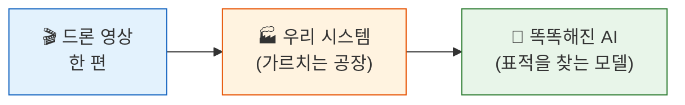
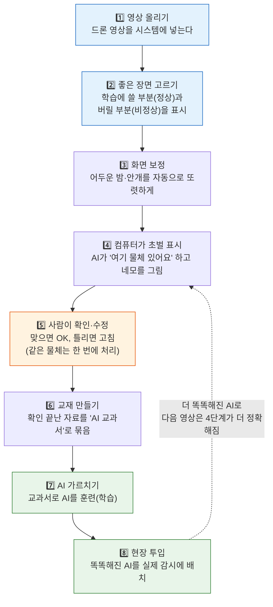
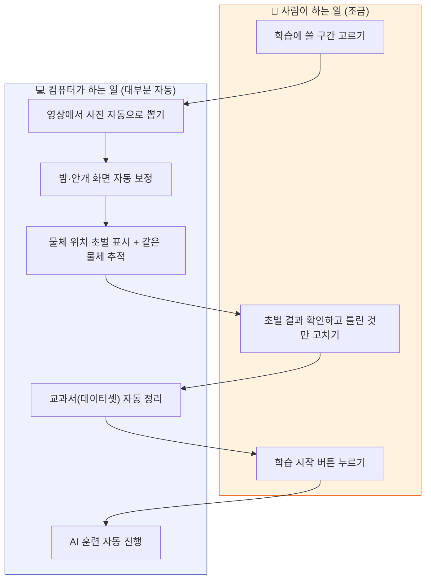
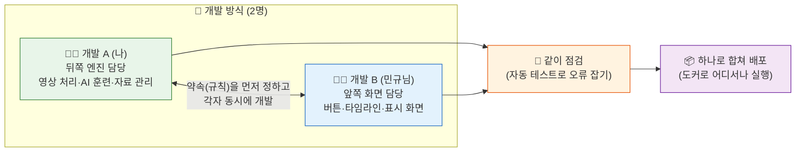

# 지금 뭘 만들고 있나 (아주 쉬운 설명)

> 대상: 개발을 전혀 모르는 사람
> 한 줄 요약: **"드론 영상을 넣으면, 사람이 조금만 도와주고, 알아서 똑똑해지는 AI를 만든다."**

---

## 1. 이게 뭐예요? (한눈에)

우리가 만드는 건 **"영상으로 AI를 가르치는 공장"** 이다.
영상을 한 편 넣으면, 그 안의 물체(전차 같은 표적)를 AI가 스스로 찾도록 **훈련**시킨다.

핵심은 **"사람은 조금만, 나머지는 컴퓨터가"** 다.
사람이 영상 한 장 한 장을 다 손보면 며칠이 걸리지만, 우리 시스템은 컴퓨터가 대부분을
자동으로 해두고 **사람은 확인·수정만** 하면 된다.

---

## 2. 어떤 순서로 일하나 (요리 레시피처럼)

> **되먹임 화살표(점선)** 가 이 시스템의 핵심이다. 한 번 가르친 AI를 다시 4단계에 넣으면,
> 다음 영상부터는 컴퓨터가 더 정확히 표시해줘서 **사람 손이 점점 덜 든다.**

---

## 3. 누가 뭘 하나 (사람 vs 컴퓨터)

사람이 하는 일은 놀랄 만큼 적다. "고르기"와 "확인"뿐이다.

- **"같은 물체 추적"** 덕분에, 영상 300장에 나오는 전차 1대는 사람이 **한 번만** 이름을
  붙이면 300장에 자동으로 퍼진다. → 일이 "사진 수"가 아니라 "물체 수"만큼만 늘어난다.

---

## 4. 우리는 지금 이 개발을 어떻게 진행하나 (2인 팀)

- 두 사람은 **"어떻게 데이터를 주고받을지(약속)"를 먼저 정한 뒤**, 뒤쪽(엔진)과
  앞쪽(화면)을 **동시에** 만든다. 그래서 서로 기다리지 않고 빨리 진행된다.
- 다 만든 뒤에는 **자동 점검(테스트)** 으로 실수를 잡고, **하나로 포장(도커)** 해서
  어느 컴퓨터에서든 똑같이 돌아가게 한다.

---

## 5. 지금 어디까지 왔나

거의 다 왔다. 8단계 중 대부분이 동작하고, 최근에는 **"학습 전에 AI가 어떻게 표시하는지
미리 보여주는 기능"**(전처리 + 물체 추적까지 미리보기)까지 붙였다.
남은 건 최종 포장(도커)과 사용 설명서 정도다.

> 더 자세한 기술 흐름은 [`architecture.md`](architecture.md), 일정은
> [`development_schedule.md`](development_schedule.md) 참고.
